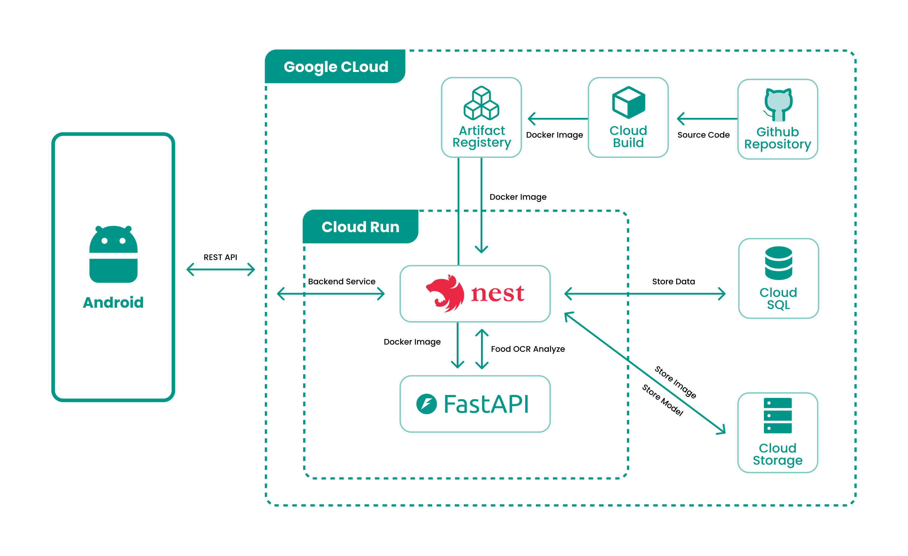

## Application Architecture

Below is the architecture diagram for the application




## List of APIs

The following APIs have been implemented in this project:


### Authentication
1. **auth/login** - User login.
2. **auth/google** - Login or register using Google Authentication.

### User
1. **user/register** - Register a new user.
2. **user/update** - Update user information.
3. **user** - Retrieve user details.
4. **user/daily-quota** - Get user's daily nutritional quota.
5. **user/history** - Retrieve user's activity history.
6. **user/nutrition-summary** - Get a summary of user's nutritional data.

### Food
1. **food/analyze** - Analyze food and its nutritional information.
2. **food/save-analyze** - Save the results of a food analysis.
3. **food** - Search, filter, or paginate through food items.
4. **food/:id** - Retrieve detailed information about a specific food item.
5. **food/save** - Save a food item.
6. **food/recommendation** - Get food recommendations.
7. **food/news** - Fetch the latest food-related news.

## Project setup

```bash
$ npm install
```

## Compile and run the project

```bash
# development
$ npm run start

# watch mode
$ npm run start:dev

# production mode
$ npm run start:prod
```

## Run tests

```bash
# unit tests
$ npm run test

# e2e tests
$ npm run test:e2e

# test coverage
$ npm run test:cov
```

